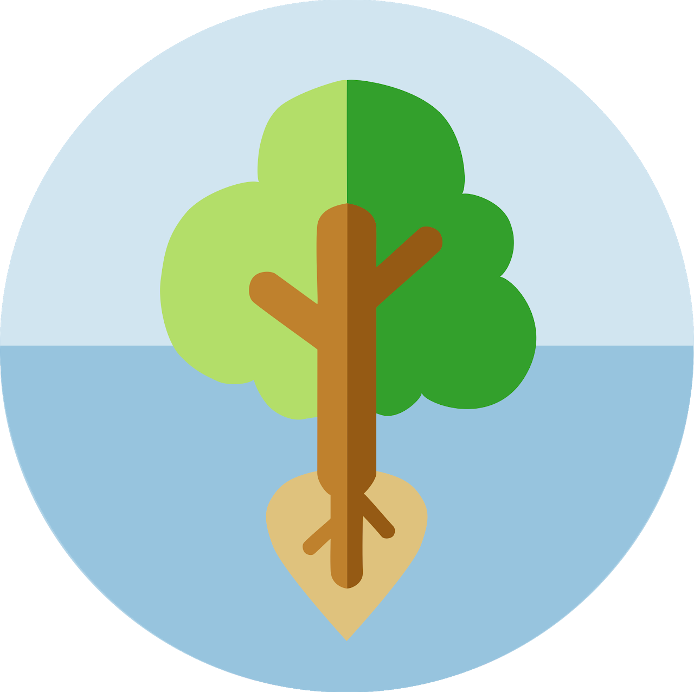

|  [**About**](about/) |  [**Projects**](projects.html) |  [**Writeups**](writeups.html) |
|:------------------------------:|:------------------------------:|:------------------------------:|
|  [**Software**](software.html)  |  [**Store**](store.html)    |  [**Contact**](contact.html) |

 **Blag Posts**

<!-- Pagination links -->

  
    <a href="{{ paginator.previous_page_path }}" class="previous">
      Previous
    </a>
  
    Previous
  
   | 
  
    <a href="{{ paginator.next_page_path }}" class="next">Next</a>
  
    Next
  
   
  
    Page: {{ paginator.page }} of {{ paginator.total_pages }}
  

